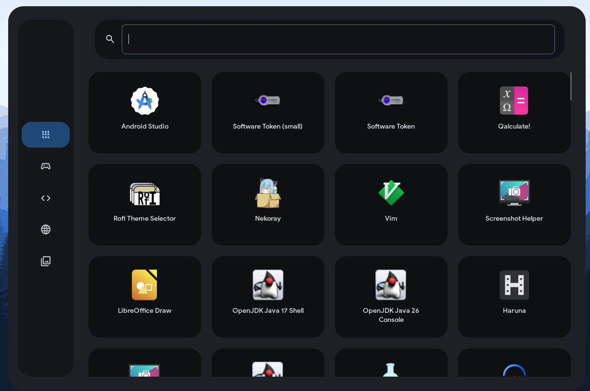
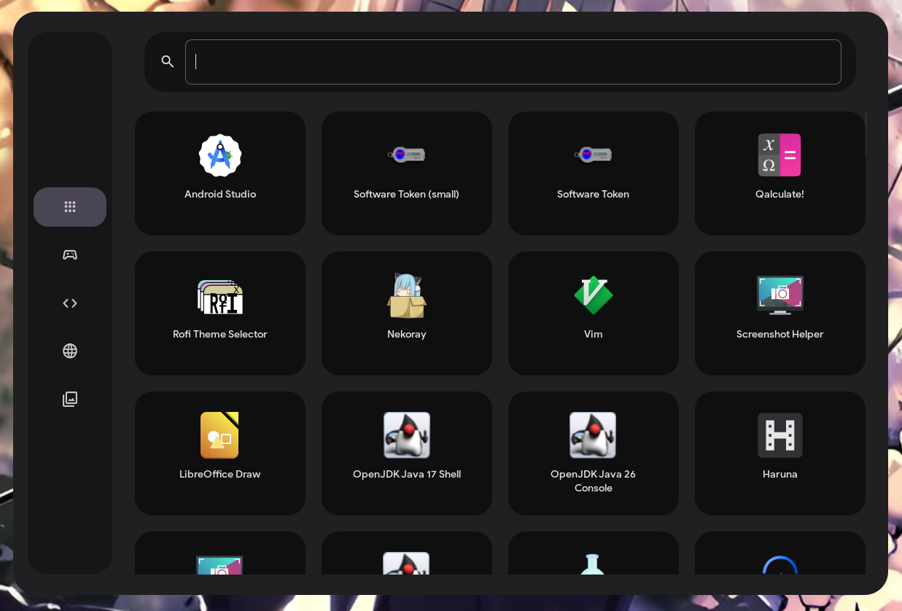
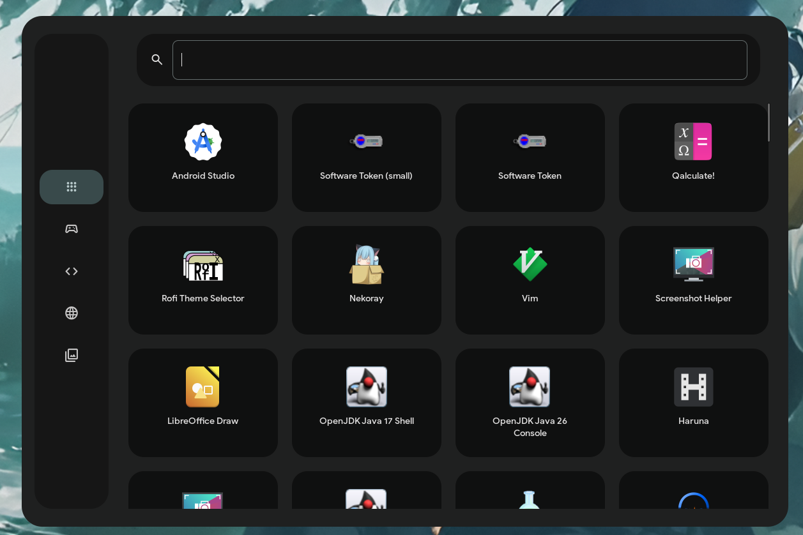

# Dash - Material Design 3 App Launcher

A beautiful, fast GTK3 app launcher for Hyprland with full Material Design 3 integration.

## Screenshots


*Main launcher with app grid and category sidebar*


*Instant search with live filtering*


*Keyboard navigation with arrow keys*

## Features

- **Material Design 3** - Full matugen color integration
- **Fast & Lightweight** - GTK3 with optimized app loading
- **Instant Search** - Type anywhere to search apps
- **Keyboard Navigation** - Arrow keys + Enter to launch
- **Flatpak Support** - Detects apps from all sources
- **Category Filtering** - Quick access to Games, Development, Internet, Media
- **Layer Shell** - Proper floating overlay using gtk-layer-shell

## Requirements

- GTK3
- gtk-layer-shell
- Python 3
- Hyprland
- matugen (for color theming)
- Google Sans font
- Material Symbols Rounded font

## Installation

Run the install script:

```bash
./install.sh
```

This will:
1. Copy `main.py` to `~/.config/hypr/scripts/dash.py`
2. Add keybind `Super+D` to launch Dash
3. Make the script executable

## Manual Installation

1. Copy the launcher:
```bash
cp main.py ~/.config/hypr/scripts/dash.py
chmod +x ~/.config/hypr/scripts/dash.py
```

2. Add to your Hyprland keybinds (`~/.config/hypr/custom/keybinds.conf`):
```
bind = SUPER, D, exec, python ~/.config/hypr/scripts/dash.py
```

3. Reload Hyprland:
```bash
hyprctl reload
```

## Usage

- **Open**: Press `Super+D`
- **Search**: Start typing (instant focus)
- **Navigate**: Use arrow keys (↑↓←→)
- **Launch**: Click app or press `Enter` on selected
- **Close**: Press `Esc` or click outside

## Customization

Dash automatically uses colors from matugen. To customize:

1. Change your wallpaper and regenerate colors:
```bash
matugen image /path/to/wallpaper.jpg --mode dark
```

2. Dash will use colors from:
```
~/.local/state/quickshell/user/generated/colors.json
```

## Configuration

Edit `main.py` to customize:
- Window size (default: 1200x800)
- Grid columns (default: 4)
- Icon size (default: 64px)
- Sidebar width (default: 100px)
- Categories and icons

## Troubleshooting

**Dash doesn't open:**
- Check if gtk-layer-shell is installed: `python -c "import gi; gi.require_version('GtkLayerShell', '0.1')"`
- Run manually to see errors: `python ~/.config/hypr/scripts/dash.py`

**Apps missing:**
- Flatpak apps: Check `/var/lib/flatpak/exports/share/applications`
- Local apps: Check `~/.local/share/applications`

**Colors not working:**
- Ensure matugen is configured and colors.json exists
- Run: `ls ~/.local/state/quickshell/user/generated/colors.json`

## Uninstall

Run the uninstall script:

```bash
./uninstall.sh
```

## License

GPL-3.0 License - Free and open source software!

## Credits

Created for Hyprland
